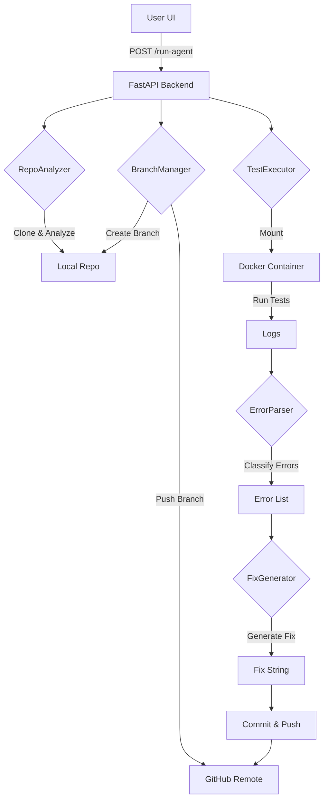

# FiXora (formerly Healing Agent) - Autonomous CI/CD Remediation Agent

<div align="center">
  <h3>✨ Autonomous Healing for Codebases ✨</h3>
  <p>Identify bugs, generate fixes, and push remediation branches automatically.</p>
</div>

---

## 🚀 Overview

**FiXora** is a powerful AI-driven application designed to automate the remediation of failing CI/CD pipelines. It autonomously clones repositories, detects failures in test suites, generates precise code fixes, and commits them to a new branch, all without manual intervention.

Built with a **Production-Grade Backend** (FastAPI, Python) and an **Immersive Frontend** (React, Three.js), FiXora bridges the gap between automated testing and automated fixing.

## ✨ Key Features

### 🧠 Intelligent Multi-Agent System
- **RepoAnalyzerAgent**: Authenticated cloning and repository structure analysis (Language, Test Framework detection).
- **TestExecutionAgent**: Orchestrates test runs inside secure Docker containers.
- **DockerExecutor**: Manages isolated environments to prevent host contamination.
- **ErrorParserAgent**: Deterministically parses logs to classify errors (Syntax, Linting, Logic, Typing).
- **FixGeneratorAgent**: Produces strict, formatted fix strings (e.g., `LINTING error in file.py line 10 → Fix: ...`).
- **BranchManagerAgent**: Handles Git branching, committing, and pushing with `[AI-AGENT]` prefixes.

### 🎨 Immersive UI
- **3D Interactive Background**: A rotating starfield built with Three.js and `@react-three/fiber`.
- **Glassmorphism Design**: Modern, semi-transparent panels with backdrop-blur effects.
- **Real-Time Data**: Live streaming of agent logs and remediation status via API polling.
- **Smooth Animations**: Powered by `framer-motion` for a premium user experience.

### 🛡️ Production Capabilities
- **Real Git Operations**: Performs actual `git clone`, `git checkout -b`, and `git push` commands.
- **Docker Sandbox**: All tests run inside `python:3.9` or `node:16` containers.
- **Secure Authentication**: Uses GitHub PAT for authenticated operations.

---

## 🛠️ Prerequisites

Before running FiXora, ensure you have the following installed:

1.  **Node.js** (v18+)
2.  **Python** (v3.9+)
3.  **Docker Desktop** (Critical! Must be running for tests to execute)
4.  **Git** installed and available in your PATH.

---

## ⚙️ Configuration

### 1. Environment Setup

Create a `.env` file in the root directory (or ensure the existing one is configured):

```env
# Required for cloning private repos and pushing changes
GITHUB_TOKEN=ghp_your_personal_access_token
```

> **Note:** Your GitHub Token must have `repo` and `workflow` scopes to push branches effectively.

---

## 🚀 How to Run

FiXora is designed to run with a single command that orchestrates both the React frontend and Python backend.

### 1. Install Dependencies

**Frontend:**
```bash
npm install
```

**Backend:**
```bash
pip install -r backend/requirements.txt
```
*(If `backend/requirements.txt` is missing, install manually: `pip install fastapi uvicorn pydantic-settings gitpython docker`)*

### 2. Start the Application

Ensure Docker Desktop is running, then execute:

```bash
npm run dev
```

This command will:
1.  Launch the **FastAPI Backend** on `http://localhost:8000`.
2.  Launch the **Vite Frontend** on `http://localhost:3000`.
3.  Proxy API requests automatically.

### 3. Access the UI

Open your browser and navigate to:
👉 **[http://localhost:3000](http://localhost:3000)**

---

## 📖 Usage Workflow

1.  **Enter Repository URL**: Paste the GitHub URL of the repository you want to heal.
2.  **Provide Details**: Enter your Team Name and Leader Name (used for branch naming: `TEAM_LEADER_AI_Fix`).
3.  **Initialize Agent**: Click the "Initialize Agent" button.
4.  **Monitor Progress**:
    - Watch the **Real-Time Logs** on the dashboard.
    - See the **Timeline** update as tests run.
    - View **Applied Fixes** in the results table.
5.  **Result**: The agent will create a new branch on your repository with the fix commits pushed.

---

## 🏗️ Architecture



---

## 🧩 Troubleshooting

-   **Error: Docker client not initialized**:
    -   Ensure Docker Desktop is running.
    -   Try running `docker ps` in your terminal to verify connectivity.

-   **Error: Write access denied**:
    -   Check your `GITHUB_TOKEN` in the `.env` file.
    -   Ensure the token has Write permissions for the repository.

-   **Frontend not connecting**:
    -   Verify the backend is running on port 8000.
    -   Check the browser console for network errors.

---

## 👨‍💻 Contributors

-   **FiXora Team** (Powered by Advanced Agentic Coding)
