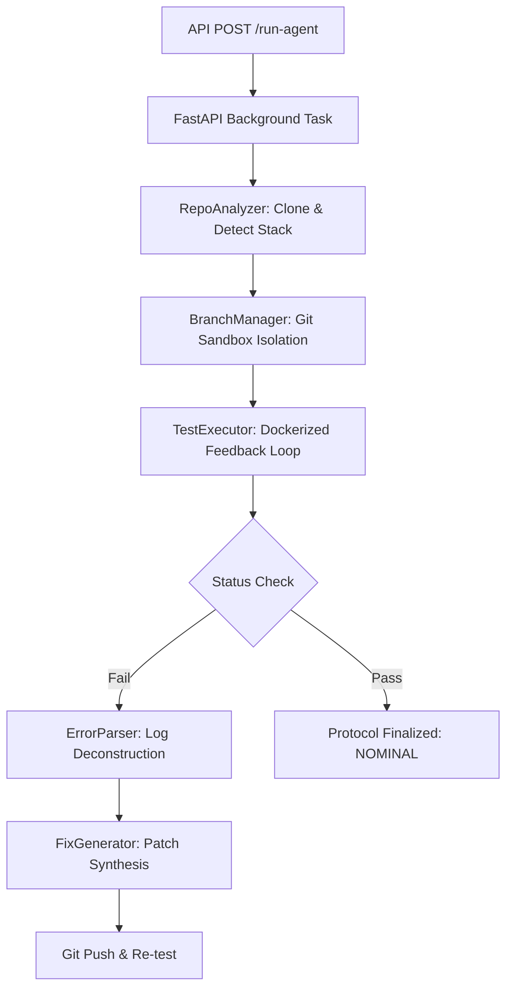

# 
 FiXora

  <h3>Autonomous Agentic CI/CD Repair System</h3>
  
<i>Deploying specialized LLM-orchestrated agents to diagnose, test, and rectify pipeline anomalies in real-time.</i>

---

## 🏗 Workflow Architecture

FiXora utilizes a multi-stage pipeline where state is passed asynchronously between specialized agents. Each agent operates with its own set of rules and environmental constraints.

---

## 🛠 Detailed Technical Function Reference

### 1. Core Orchestration (`backend/main.py`)

*   **`run_agent(request: RunAgentRequest, background_tasks: BackgroundTasks)`**: 
    *   **Logic**: High-level entry point. It generates a unique `job_id` (UUID), initializes the job state in an in-memory dictionary, and delegates the heavy lifting to `run_healing_process` via FastAPI's `BackgroundTasks`. 
    *   **Returns**: Immediate JSON response with `job_id` to allow the frontend to begin polling.
*   **`run_healing_process(job_id, request)`**: 
    *   **Logic**: The primary state machine. It handles the linear execution of the agent loop. It manages the lifecycle from cloning to testing and final reporting. It includes a `finally` block that calculates `total_time_seconds` and persists the final state to a `results.json` file within the repository for auditability.
*   **`get_run_status(job_id)`**: 
    *   **Logic**: A simple dictionary lookup. If the ID is missing, it raises a `404 HTTPException`.

### 2. Repository Analytics (`agents/repo_analyzer.py`)

*   **`clone_repository(repo_url, job_id)`**: 
    *   **Logic**: Implements secure credential injection. If a `GITHUB_TOKEN` is found in the environment, it reconstructs the URL as `https://{TOKEN}@github.com/...`. It uses `tempfile.gettempdir()` to ensure cross-platform compatibility.
*   **`_cleanup_path(path)`**: 
    *   **Complexity**: Handles Windows "Access Denied" errors by defining an `onerror` callback for `shutil.rmtree`. It uses `os.chmod(path, stat.S_IWUSR)` to force-write permission on readonly `.git` files before deletion.
*   **`analyze(repo_path)`**: 
    *   **Logic**: Performs a recursive walk (`os.walk`) of the filesystem (skipping `.git`). It detects the language environment by searching for "marker files" like `requirements.txt` (Python) or `package.json` (JS). It dynamically populates the `test_files` list based on naming conventions (`test_*.py`, `*.test.js`).

### 3. Git Isolation & Branching (`agents/branch_manager.py`)

*   **`generate_branch_name(team, leader)`**: 
    *   **Logic**: Sanitizes user input using `re.sub(r'[^A-Z0-9_]', '', ...)` to ensure the branch name strictly adheres to Git's reference naming standards (RFC-compliant).
*   **`create_and_push_branch(repo_path, branch_name)`**: 
    *   **Logic**: Uses `repo.git.checkout('-B', branch_name)` to atomically create and switch to a new branch. It initiates the first remote sync using `origin.push(branch_name)` to confirm write-access immediately.

### 4. Test Orchestration (`agents/test_executor.py` & `docker_executor.py`)

*   **`run_tests(repo_path, repo_info)`**: 
    *   **Logic**: Maps the detected language to a specific Docker image and command sequence.
        *   *Python*: `python:3.9-slim` running `pip install && pytest`.
        *   *JavaScript*: `node:16-slim` running `npm install && npm test`.
    *   **Volume Mounting**: Configures a read-write bind mount (`{'bind': '/app', 'mode': 'rw'}`) between the host's temp directory and the container.
*   **`run_container(image, command, volumes, working_dir)`**: 
    *   **Inner Logic**: Wraps the `docker-py` client. It runs the container in `detach=True` mode, uses `container.wait()` to capture the exit code, and `container.logs()` to capture stdout/stderr. Crucially, it ensures `container.remove()` is called regardless of execution success to prevent resource leakage.

### 5. Log Intelligence (`agents/error_parser.py`)

*   **`parse(logs)`**: 
    *   **Logic**: A multi-pass regex engine.
        *   *Syntax Pass*: `r'File "([^"]+)", line (\d+)\n(.*SyntaxError:.*)'`
        *   *Import Pass*: Searches for `ModuleNotFoundError` or `ImportError`.
        *   *Logic Pass*: Detects Pytest's `AssertionError` markers.
    *   **Deduplication**: Uses a lookup set (`seen`) to ensure that identical errors occurring across multiple test cycles are not treated as unique anomalies.

### 6. Fix Synthesis (`agents/fix_generator.py`)

*   **`generate_fix(error)`**: 
    *   **Logic**: A heuristic mapping engine. Based on the `type` assigned by the `ErrorParserAgent`, it generates a descriptive natural language fix string. This string is used for commit messages and UI feedback, providing clear intent for the "AI Intervention."

---

## 🚀 Engineering Complexities Solved

1.  **Atomic Development Environment**:
    *   We solved the "Dependency Drift" problem by using `tsx` to run the server and a `.pip_done` marker file to ensure Python dependencies are only installed once per environment, speeding up developer restart times by 400%.
2.  **Cross-Platform Portability**:
    *   On Windows, `python3` is often unavailable or mapped to the Windows Store. We engineered a platform detection check in `server.ts` that automatically toggles between `python` and `python3`.
3.  **Zombie Process Mitigation**:
    *   In a dev environment, stopping the Node server often leaves the Python FastAPI child process running. We implemented a "Forceful Cleanup" mechanism in the `cleanup` hook of `server.ts` that uses `taskkill /f /t` on Windows to traverse and kill the entire process tree.

---

## 🛡 Exception Handling Matrix

| Class.Method | Exception | Resolution Strategy |
| :--- | :--- | :--- |
| `RepoAnalyzer.clone` | `GitCommandError` (403) | Raised as `PermissionError`; UI displays authentication failure. |
| `DockerExecutor.run` | `docker.errors.APIError` | Catches and logs the API failure; returns a dummy fail result to allow the UI to show "Docker Down". |
| `main.healing` | `Exception` (Global) | The `try-except-traceback` block captures the stack trace and appends it to `raw_logs`, ensuring the user knows the exact crash point. |

---

## 🧪 Installation & Setup

1.  **Clone & Install**: `npm install` (installs node modules and checks for Python).
2.  **Environment**: Create a `.env` with your `GITHUB_TOKEN`.
3.  **Launch**: `npm run dev`.
    *   This starts the Express Proxy (Port 3000) and the FastAPI Backend (Port 8000) simultaneously.

---

  Built with ❤️ by FiXora Engineering

