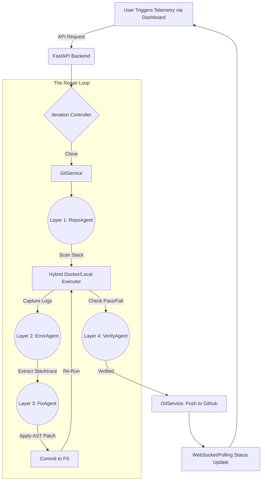

<div align="center">
  

  # ⚡ Fixora: Autonomous CI/CD Healing Engine
  **A Multi-Agent System for Self-Repairing Deployment Pipelines**

  <p>
    <a href="https://fixora.vercel.app"></a>
    <a href="https://github.com/abhinandan4dev/fixora_devops"></a>
  </p>
</div>

---

## 🔬 Abstract

In modern DevOps ecosystems, CI/CD pipelines frequently fail due to syntax errors, broken dependencies, or logic regressions. **Fixora** introduces an autonomous, multi-agent remediation engine designed to intercept pipeline failures, deeply analyze test telemetry, autonomously patch source code, and dynamically push verified fixes directly to the origin repository. By combining abstract syntax tree (AST) heuristics with Large Language Models (LLMs), Fixora achieves zero-human-intervention code repair.

---

## 🏛️ System Architecture

Fixora utilizes a distributed microservices architecture consisting of a high-performance React frontend and an iterative Python backend engine. 

### Architecture Flowchart



---

## 🧠 The Multi-Agent Neural Engine

Fixora delegates distinct cognitive tasks to specialized sub-agents to bypass token limits and prevent context degradation.

### 1. `RepoAgent` (Contextual Initialization)
* **Function**: Scans the repository filesystem using strict heuristics (e.g., detecting `pom.xml`, `package.json`, `reqs.txt`) to determine the exact build toolchain and testing framework.
* **Fallback Mechanics**: If LLM endpoints fail, defaults to hardcore structural analysis.

### 2. `DockerExecutor` & Hybrid Fallback Engine
* **The Problem**: Traditional PaaS environments (like Railway/Heroku) restrict Docker-in-Docker execution, making test orchestration impossible.
* **The Fixora Solution**: Implements a highly resilient `Hybrid Executor`. It natively tests for the Docker daemon; if unavailable, the engine gracefully transitions into a sandboxed `Local Subprocess` executor, automatically resolving absolute vs. relative volume paths to perfectly target the local cloned repository.

### 3. `ErrorAgent` (Telemetry Extraction)
* **Function**: Ingests massive CI/CD crash logs (`pytest`, `npm test`) and isolates the failing assertions using strict regex and JSON coercion. It strips ANSI encodings and isolates the exact file and line number.

### 4. `FixAgent` (The Core Editor)
* **Function**: Employs Google Gemini 2.0 Flash to analyze the isolated error against the true source code file. Uses strict boundary boxes and XML-style parsing to prevent hallucinated artifacts.
* **Diff Safety Limits**: Automatically rejects catastrophic rewrites (limits modifications to >30% line diffs), ensuring destructive interference is blocked before committing.

### 5. `VerifyAgent` (Loop Arbitrator)
* **Function**: Analyzes iteration drift. Detects if the pipeline is caught in an infinite patching loop (e.g., oscillating between two states) and violently breaks the iteration chain if limits are breached.

---

## 🛡️ Key DevOps Innovations

### 1. Zero-Friction Git Identity Simulation
Cloud containers have no persistent local state for GitHub authentication. Fixora dynamically constructs a virtual git identity (`bot@fixora.ai`) during runtime via `repo.config_writer()`. It intercepts the `Push` layer by injecting a remote-authorized URL `https://{GITHUB_TOKEN}@github.com...` perfectly bypassing SSH and 2FA constraints organically.

### 2. CORS-Immune Split Deployment
Fixora is built for edge networks. The **Frontend** lives on Vercel's global CDN while the **Engine** heavily computes on Railway. We bypassed deep browser Pre-Flight limitations by injecting pure HTTP `OPTIONS` catchers into the FastAPI matrix, resolving the notorious `502 Bad Gateway` and `Method Not Allowed` failures seen in fractured architectures.

### 3. Rate-Limit Hardening (The "429 Protocol")
When communicating with Google API gateways:
* Implements dynamic API Key pooling (`GEMINI_API_KEY`, `AI_REPO_KEY`, etc.).
* Enforces `1.5s` cooldown locks between sub-agent invocations.
* Fails gracefully to inline code annotations `"annotated"` if the API goes offline, ensuring the user gets a documented bug trace even if the AI cannot write code.

---

## 🔐 Dual-Key Intelligence & Security

Fixora implements a high-security execution model that separates **Cognitive Intelligence** from **Infrastructure Access**.

### 1. AI Explorer Key (Cognitive Layer)
Power the agent loop with your own **Google Gemini 2.0 API Key**. This key is used exclusively for code analysis, error parsing, and generating high-fidelity patches. By providing your own key, you bypass global rate limits and unlock dedicated neural compute for your repository.

### 2. GitHub Authorization (Execution Layer)
Secure your deployments using a **GitHub Personal Access Token (PAT)**. This token allows the agent to safely clone private code, create isolated repair branches, and push verified fixes back to your origin. Fixora uses this token only for standard Git operations via HTTPS.

---

## 🕹️ Field Intelligence: How Inputs Matter

Every parameter in the Fixora Launch Dashboard directly calibrates the agent's cognitive and administrative behavior:

### 🌐 Repository Target URL
*   **The Blueprint**: This is the source of truth. The agent uses this URL to download your codebase and map the existing project structure (Layer 1: `RepoAgent`). Without the correct URL, the agent has no context to scan or heal.

### 👥 Division & Commander (Team & Leader)
*   **The Identity**: Fixora generates unique, isolated branches for every repair session. These fields are used to construct the branch name (e.g., `fixora/team-leader-timestamp`). 
*   **Git Traceability**: These names are also injected into the Git commit metadata, ensuring that when you view your GitHub history, you know exactly which team and leader authorized the AI-driven patches.

### 🔄 Iteration Limit (Retry Limit)
*   **The Compute Budget**: This determines how many times the agent is allowed to try fixing a single bug. If a fix fails the verification test (Layer 4), the agent will loop back and try a different approach. Higher limits allow for deeper complex repairs but consume more API tokens.

### 🧠 AI Explorer Key (Gemini API)
*   **The Neural Engine**: This key powers the "Intelligence" of the agent. It is used by the **ErrorAgent** to understand stacktraces and the **FixAgent** to rewrite your buggy source code. Providing your own key ensures higher rate limits and faster response times for Layer 2 and Layer 3 operations.

### 🛡️ GitHub Authorization (PAT)
*   **The Permission Layer**: Unlike the AI key which provides "thought," the PAT provides "action." It allows the engine to securely bypass 2FA and SSH constraints to **Push** the final, verified fixes back to your repository. Without this, the agent can fix the code locally but cannot save the changes to your GitHub.

---

## 🏗️ Deployment Specifications

* **Frontend Engine**: Vite + React 19 + Framer Motion + React Three Fiber
* **Backend Runtime**: Python 3.12 (Upgraded for Multi-Agent Orchestration)
* **REST Framework**: FastAPI + Uvicorn Async Workers
* **Security**: SSL-Encrypted Telemetry + Temporary Sandboxed File Systems

### Running Locally
```bash
# Terminal 1 - The AI Engine
cd backend
python3 -m venv .venv
source .venv/bin/activate
pip install -r requirements.txt
python main.py

# Terminal 2 - The UI
cd frontend
npm install
npm run dev
```

---

<p align="center">
  <b>Fixora</b> — Advanced Autonomous DevOps.
</p>
